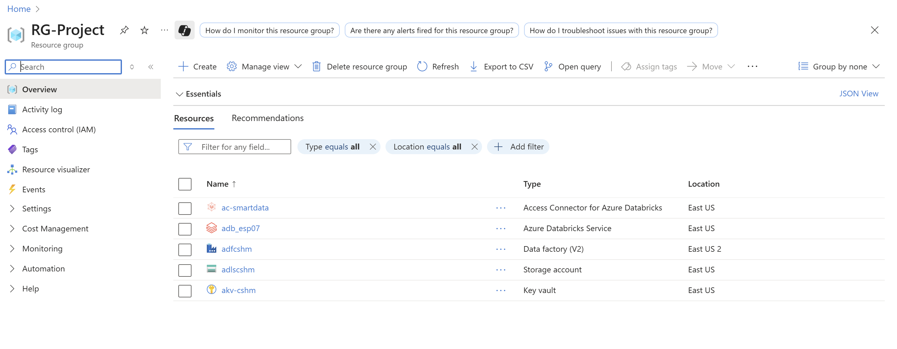
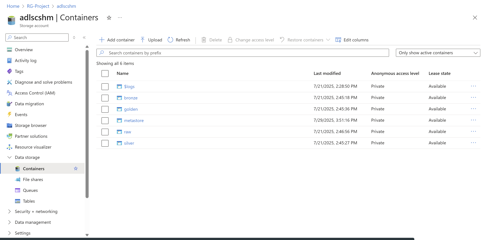
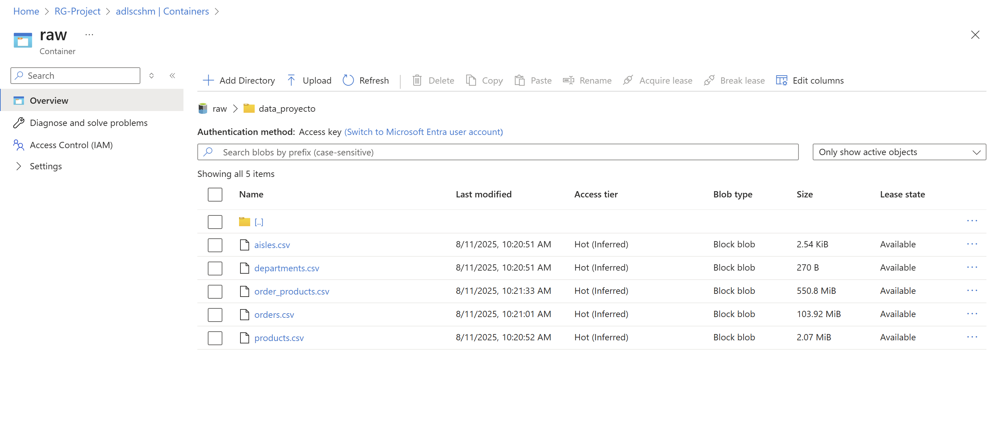
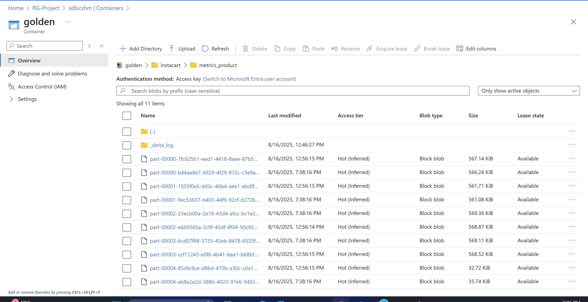
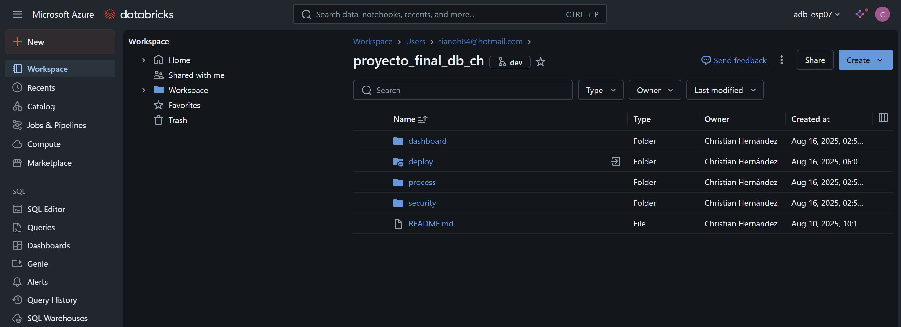
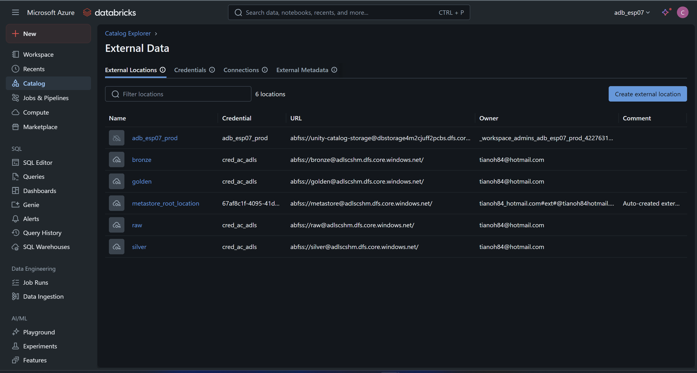
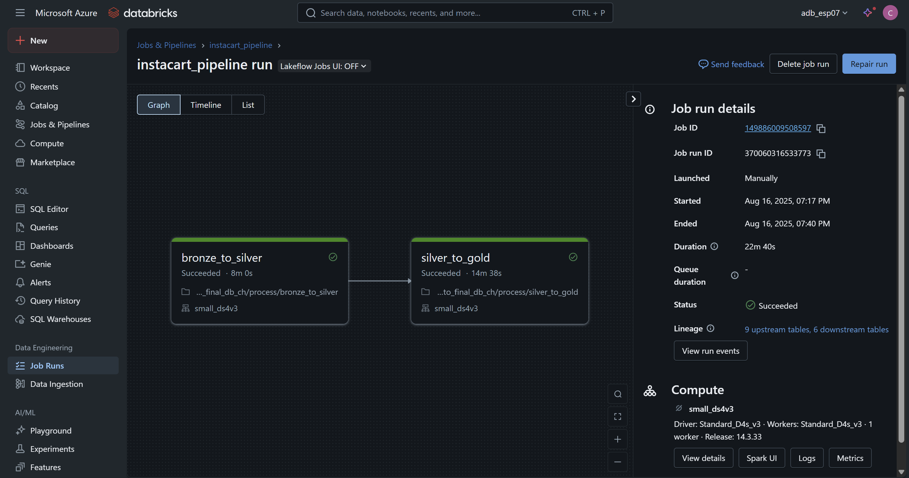
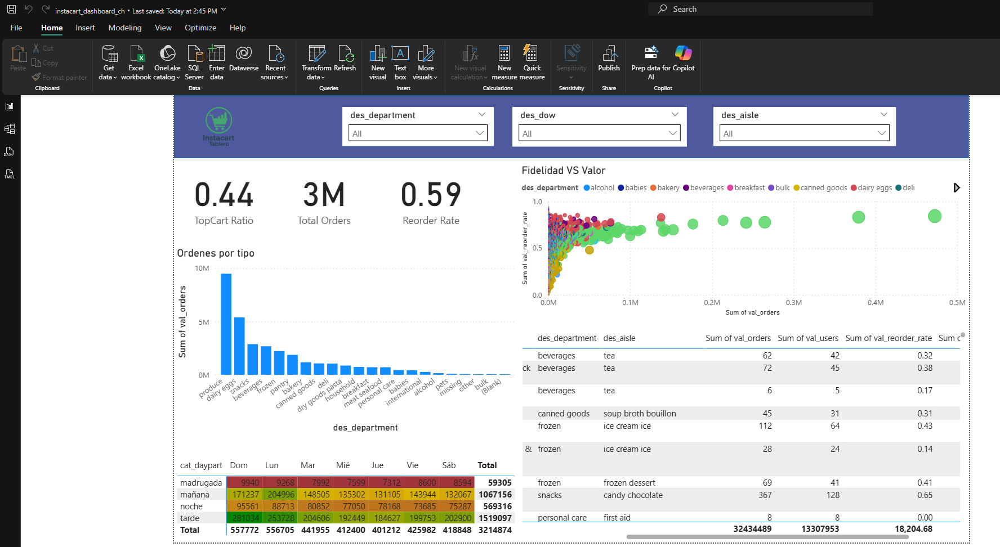

# Proyecto Final – Arquitectura Medallion en Databricks

##  Autor
Christian Sebastián Hernández Mosquera  
Curso: **Ingeniería de Datos e IA con Databricks**  
Fecha: **16 de agosto de 2025**  

## Repositorio github
[REPOSITORIO GITHUB](https://github.com/cshernandez9702/proyecto_final_db_ch/tree/dev)

##  Descripción
Este proyecto implementa un pipeline de datos basado en la **arquitectura Medallion (Raw → Bronze → Silver → Gold)** en **Azure Databricks**, usando el dataset de Instacart disponible en Kaggle:  
[Instacart Market Basket Analysis](https://www.kaggle.com/datasets/psparks/instacart-market-basket-analysis).

##  Arquitectura
La solución se aprovisionó en el **Resource Group `RG-Project`** en Azure con los siguientes servicios:
- **Azure Databricks** → motor principal de procesamiento.  
- **Azure Data Lake Storage (ADLS Gen2)** → almacenamiento externo con contenedores: `raw`, `bronze`, `silver`, `gold`.  
- **Azure Key Vault** → gestión de secretos.  
- **Unity Catalog** → metastore externo en ADLS para gobierno del dato.  
- **Azure Databricks Connector** 

##  Estructura de datos
- Contenedor **Raw**: 5 archivos CSV originales desde Kaggle.  
- Contenedor **Bronze/Silver/Gold**: Tablas externas (Delta) gestionadas en Unity Catalog.  

##  Procesos ETL
1. **Raw → Bronze**  
   - Ingesta de CSV desde ADLS.  
   - Creación de tablas externas en formato Delta.  

2. **Bronze → Silver**  
   - Renombrado de columnas (`cod_`, `des_`, `val_`, `fec_`).  
   - Enriquecimiento con columnas derivadas (ej. `flg_weekend`, `cat_daypart`, `cat_recencia`).  

3. **Silver → Gold**  
   - Generación de métricas analíticas:
     - `metrics_product` (reorder rate, top cart ratio, first-time buys, etc.)  
     - `metrics_time` (comportamiento por día y franja horaria).  
   - Estas métricas son la base para visualización en Power BI.  

##  Visualización
- Conexión desde Power BI a Databricks con **DirectQuery**.  
- Dashboard creado con:
  - Tablas de detalle por producto y departamento.  
  - Gráficas de órdenes por hora del día.  
  - Heatmap de usuarios vs día de la semana.  
  - KPIs principales (reorder rate, top cart ratio, compras primerizas). 

##  Seguridad
- External Locations en ADLS protegidas con **Managed Identity**.  
- Permisos otorgados vía Unity Catalog al usuario del proyecto.  

##  Orquestación
- Se descartó Azure Data Factory (ADF) ya que todo el pipeline vive en Databricks.  
- Se configuró un **Job de Databricks** con un `databricks.yml` para definir:
  - Job clusters pequeños (tipo `Standard_D4s_v3`).  
  - Schedule automático a las **06:00 hora de Guayaquil** (`America/Guayaquil`).  
  - Dependencias entre tasks (`bronze_to_silver` → `silver_to_gold`).  

##  Versionado
Todo el proyecto fue versionado en **GitHub** incluyendo notebooks y YAML.  

##  Capturas (Anexos)

## GRUPO DE RECURSOS

##  CONTENEDORES ADLS

##  CONTENEDOR RAW

##  CONTENEDOR GOLD

##  AZURE DATABRICKS

##  EXTERNAL DATA

##  JOB RUNS

##  TABLERO

